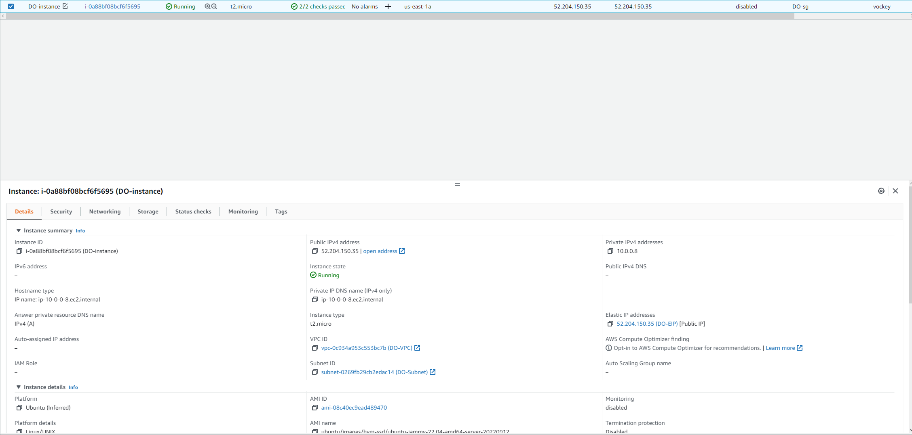

## Part 1

1. **VPC**  

      
   Creates a virtual network defined by the user that protects/isolates data and resources in the cloud
  
2. **Subnet**  

   
    - Makes networks more efficient by allowing them to pass by unnecessary routes
    - It is a range of ip addresses in your VPC
  
3. **Internet Gateway**   

   
    - Connects two different networks and allows the transfer/communication of data to different protocols
    - Enables communication between your VPC and the internet
    - Performs network address translation (NAT) for instances that have been assigned public IPv4 addresses
  
4. **Routing Table**  

      
    - Uses rules(routes) that help determine where network traffic from your subnet or gateway is directed
  
5. **Security Group**  

      
    - Controls inbound and outbound traffic for the EC2 instance and manages accounts
  
## Part 2

1. AMI: `08c40ec9ead489470 (Ubuntu Server 20.04 LTS (HVM), SSD Volume Type)`
    - ubuntu
    - t2.micro
    
2. I selected `Configure Instance Details` and scrolled to Network and selected my VPC

3. I selected to not auto-assign the instance since I was going to associate an elastic ip with the instance later. 

4. Volume: I selected `16 GB` and the `General Purpose SSD`

5. Tags: I changed the Key to Name and for the value wrote `DO-instance`

6. Security group: I selected choose an existing security group and choose `DO-sg`

7. Selected my elastic ip that I created, then went to the actions dropdown menu and selected associated Elastic IP address. Then chose my instance and the auto private ip address.   

     

9. Change hostname with this command (DO-ubuntu2 is the hostname): `sudo hostnamectl set-hostname DO-AMI--static` 
  (and log out and back in for it to change)   
  
 
